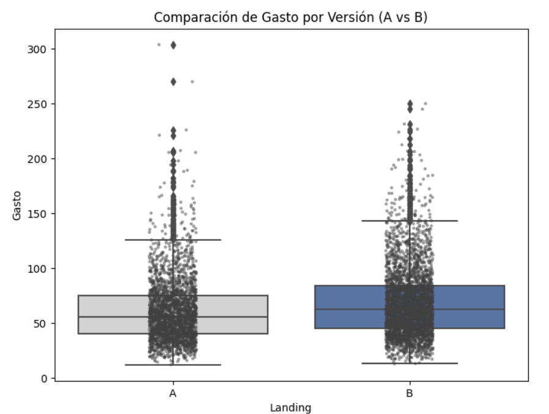
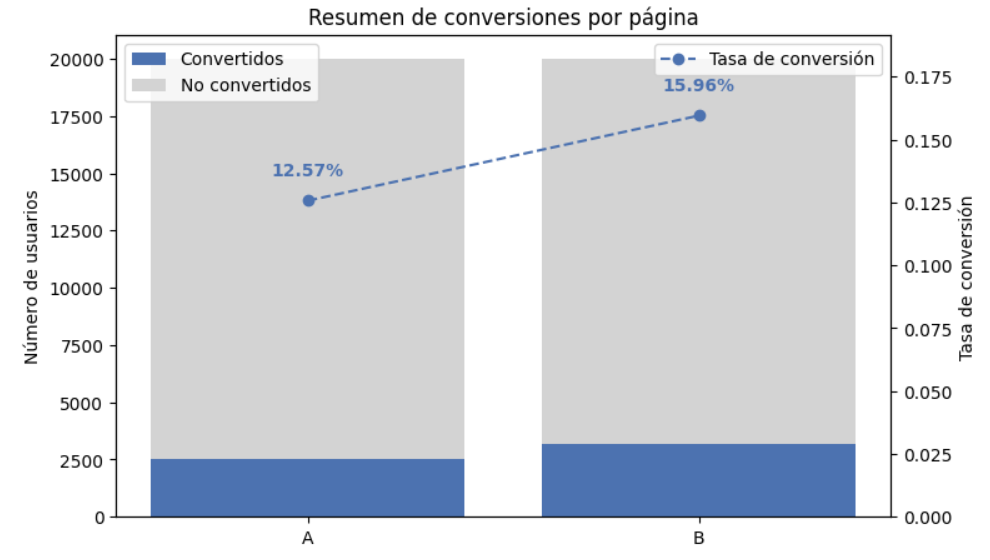
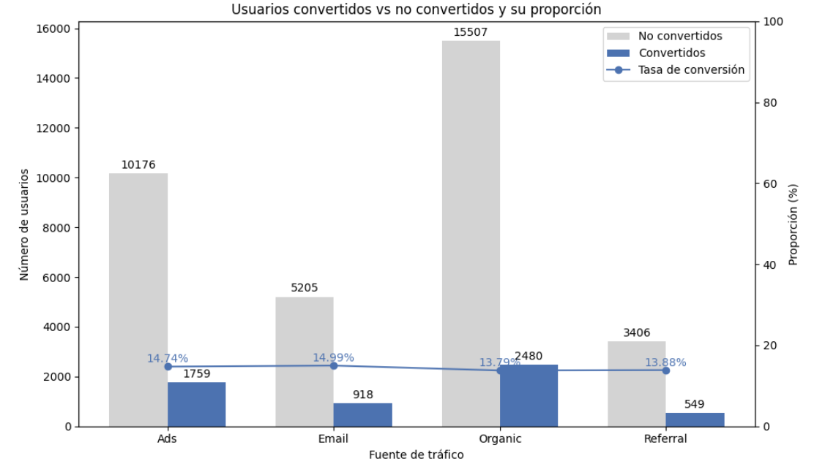
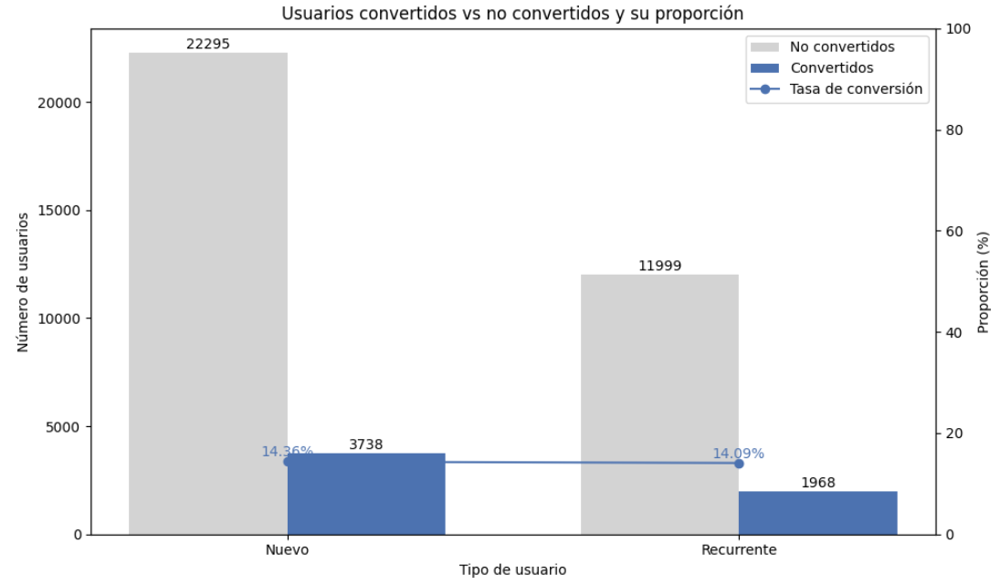

# Validando hipótesis de negocio con pruebas estadísticas

Se ejecutó un experimento A/B en la página de inicio (landing page), comparando dos versiones (A y B) con el objetivo de mejorar la tasa de conversión y el valor económico por usuario.

La empresa necesita una decisión basada en datos para definir qué versión implementar, considerando la tasa de conversión, el gasto promedio y el comportamiento por canal de tráfico y tipo de usuario.

## 💡 Preguntas del negocio
¿Existe una diferencia significativa en el gasto promedio por usuario convertido entre ambas versiones?
¿Qué versión de la página (A o B) genera mayor tasa de conversión?
¿La conversión depende de la fuente de tráfico?
¿El tipo de usuario (nuevo o recurrente) influye en la conversión?
¿Qué hallazgos o insights permiten optimizar la estrategia de marketing y el diseño de la página de inicio (landing page)?

## 🌟 Insight Ejecutivo basado en el Experimento A/B

🔍 Comparación de página (A vs B)

### Gasto promedio por usuario que convirtió:

Gasto promedio página A: 61.09

Gasto promedio página B: 68.75

La diferencia es de: 7.6587

Interpretación:
Los resultados presentados indican que la página B tiene un gasto promedio superior al de la página A (7.66 unidades). Esto sugiere que la versión B está funcionando mejor en términos de gasto promedio entre los usuarios que realizan una conversión.

  

### Tasa de conversión:

Tasa de conversión página A: 12.57%

Tasa de conversión página B: 15.96%

Diferencia (B - A): 0.034

Interpretación:
La diferencia de tasa de conversión entre B y A es de 3.4 puntos porcentuales, mostrando que la página B cuenta con un mejor desempeño. Esto sugiere que la versión B es más efectiva para convertir usuarios y podría considerarse como la opción preferida para aumentar ingresos o registros.

  

## 📊 Segmentación por fuente de tráfico

Usuarios convertidos (absolutos)
Ads- 1759

Email- 918

Organic- 2480

Referral- 549

Usuarios convertidos (proporción)
Ads- 14.74%

Email- 14.99%

Organic- 13.79%

Referral- 13.88%

Interpretación:

El canal Organic concentra la mayor parte del tráfico y también el mayor número absoluto de conversiones (2,480). Sin embargo, su tasa de conversión (13.79%) es menor que la de otros canales, lo que sugiere que, aunque genera volumen, no es el canal más eficiente para convertir usuarios.

Por otro lado, Email presenta la tasa de conversión más alta (14.99%), pese a tener un volumen de usuarios significativamente menor. Esto indica que los usuarios provenientes de Email tienen mayor probabilidad de convertir, lo que sugiere que este canal podría ser especialmente efectivo para campañas dirigidas o estrategias de retención.

  

## 📊 Segmentación por tipo de usuario

Usuarios convertidos (absolutos)
Nuevo- 3738

Recurrente- 1968

Usuarios convertidos (proporción)
Nuevo- 14.36%

Recurrente- 14.09%

Interpretación:

Los usuarios nuevos y recurrentes presentan tasas de conversión prácticamente iguales (14.36% vs. 14.09%). Un aspecto a destacar es que aunque los usuarios nuevos representan un mayor volumen de tráfico y conversiones en términos absolutos, la probabilidad de convertir es muy similar entre ambos grupos.

Esto sugiere que el tipo de usuario no tiene un impacto relevante en la conversión.

  

Las visualizaciones usadas respaldan los resultados estadísticos de pasos anteriores.

## 💡 Recomendaciones de negocio:
1. Optimizar y escalar la página B
Dado que la página B muestra un mayor gasto promedio y una mayor tasa de conversión, se recomienda adoptarla como la versión principal de la landing page. Adicionalmente, sería conveniente analizar qué elementos específicos de esta versión (diseño, copy, estructura o llamada a la acción) están impulsando el mejor desempeño para replicarlos en futuras optimizaciones o experimentos A/B.

2. Continuar con experimentación para mejorar la conversión
Aunque la página B muestra mejores resultados, se recomienda continuar realizando pruebas A/B sobre elementos clave con el objetivo de seguir incrementando la tasa de conversión y el gasto promedio por usuario.

3. Optimizar la eficiencia del canal Organic
El canal Organic genera el mayor volumen de tráfico, pero su tasa de conversión es menor que la de otros canales. Por ello, se recomienda analizar la calidad del tráfico orgánico para aumentar su eficiencia en conversión.

4. Potenciar el canal Email
Dado que Email presenta la mayor tasa de conversión, se recomienda fortalecer las estrategias de email marketing. Incrementar el alcance de este canal podría generar un mayor número de conversiones manteniendo una alta eficiencia.

5. Priorizar estrategias transversales en lugar de segmentación por tipo de usuario
Debido a que los usuarios nuevos y recurrentes presentan tasas de conversión similares, se recomienda centrar los esfuerzos de optimización en mejorar la experiencia general del usuario y el proceso de conversión, en lugar de enfocar la estrategia únicamente en uno de estos segmentos.

